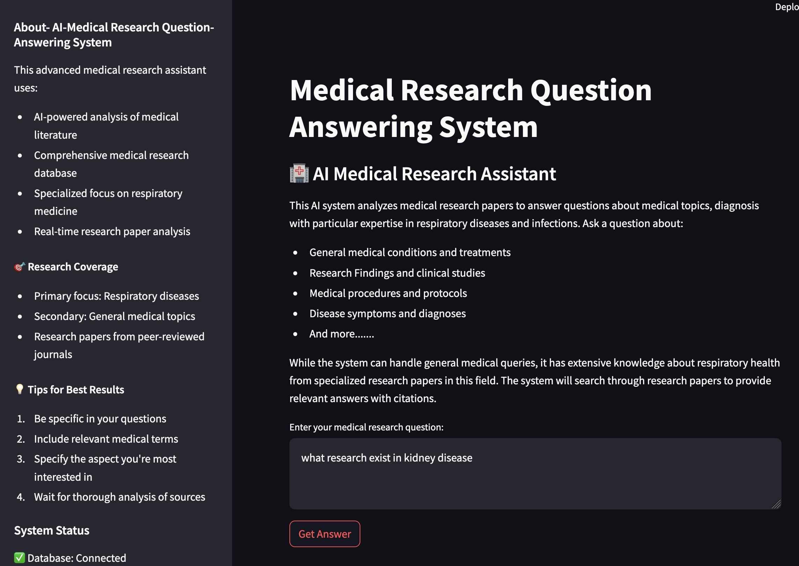
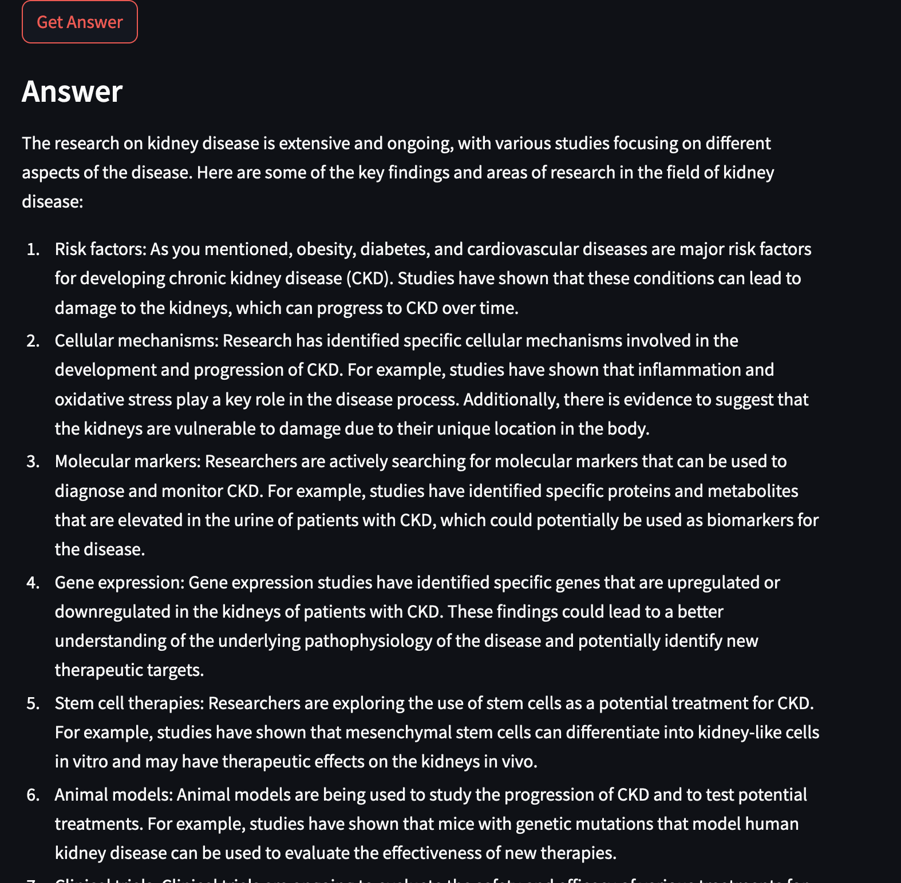

# AI-Medical-Research-Question-Answering-System
AI - Medical Research QA System :
Project Objective
This project aims to create an intelligent question-answering system specifically designed for medical research. It leverages advanced RAG (Retrieval Augmented Generation) technology to provide accurate, research-backed responses to medical queries by accessing and analyzing a comprehensive database of medical research papers and literature.

# Task
Built RAG (Retrieval-Augmented Generation) system that utilizes Ollama LLM to answer medical research queries with source citations.

## Features
- Vector-based search using ChromaDB 
- Natural language query interface with Streamlit
- Source citation for answers
- Semantic matching using Sentence Transformers

## Prerequisites
- Python 3.8+
- Ollama (install from [ollama.ai](https://ollama.com/download/windows))
- 8GB RAM minimum
- 20GB disk space

# Tech stack 

<p align="center">
    
    
    
    
    
</p>

## Installation and Usage
```bash
# Step1:  Clone repo
git clone https://github.com/Modupeolawuraola/AI-Medical-Research-Question-Answering-System

# Step 2: Create a virtual environment and setup the virtual environment with the command below
python -m venv -rag_env
source rag_env/bin/activate

# Step3: Install dependencies
pip install -r requirements.txt

#Step 4: download ollama locally on your computer  using the link below
install ollama : https://ollama.com/download/windows

# Step5: Pull Llama2 model
ollama pull llama2

# Step6: re-run the setuptool -setup.py and pyproject.toml tool by running the command below
pip3 install  -e .

#step7: Run the test code to confirm the app is running effectively with the command below
python test_rag.py

# Step 8: usage
streamlit run streamlit_app.py
```
## App Screenshot 




## Who Can Use This System?

### Healthcare Professionals
- Medical Doctors seeking quick access to research findings
- Medical Researchers looking to explore existing literature
- Healthcare Students studying medical research papers
- Clinical Trial Coordinators needing to reference similar studies

### Academic Community
- Medical School Students
- Research Scholars in healthcare fields
- University Professors teaching medical courses
- PhD Candidates conducting literature reviews

## Research Organizations
- Medical Research Institutes
- Pharmaceutical Companies
- Healthcare Technology Companies
- Clinical Research Organizations

### Healthcare Writers and Communicators
- Medical Journal Editors
- Healthcare Content Writers
- Medical Documentation Specialists
- Health Education Content Creators

### Benefits for Users
- Quick access to relevant medical research information
- Evidence-based responses backed by research papers
- Time-saving alternative to manual research
- Ability to explore complex medical topics efficiently
- Access to comprehensive medical literature analysis

## Folder structure 
```bash
medical-research-qa-rag/
├── README.md
├── assets/
├── docs/
├── rag_env/ ✗[.gitignore]
├── src/
│   ├── medical_rag.egg-info/ ✗[.gitignore]
│   └── rag/
│       ├── ui/
│       │   └── streamlit_rag_app/
│       ├── __init__.py
│       ├── database.py
│       ├── embedding.py
│       ├── preprocessing.py
│       ├── retrieval.py
│       └── utils.py
├── tests/
│   ├── data/ ✗
│   ├── medical_research_db/ ✗[.gitignore]
│   └── test_rag.py
├── .gitignore
├── main.py
├── pyproject.toml
├── requirements.txt
└── setup.py
```